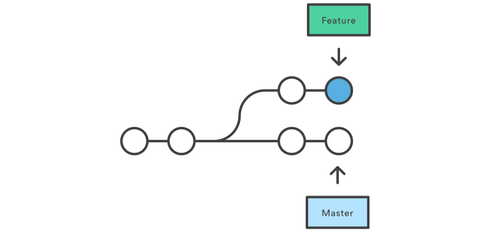
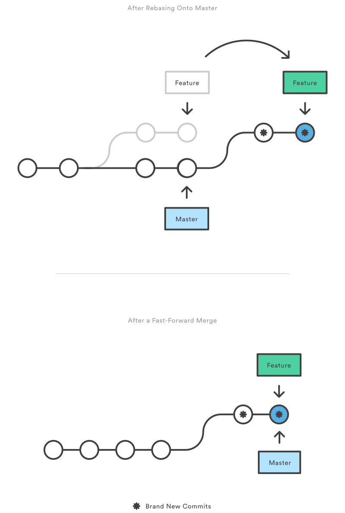

# Git cours complet
--------------------

  

## Table des matières
1. [Premiers commits](#1)
    1. [config](#1a)
    1. [init](#1b)
    1. [status](#1c)
    1. [add](#1d)
    1. [commit](#1e)
    1. [log](#1f)
    1. [diff](#1g)
1. [Revenir en arrière](#2)
    1. [checkout](#2a)
    1. [revert](#2b)
    1. [reset](#2c)
1. [lLes branches](#3)
    1. [branch](#3a)
    1. [checkout](#3b)
    1. [merge](#3c)
        1. [Fast-Forward ?](#3d)
1. [Manipuler l'historique](#4)
    1. [amend](#4a)
    1. [rebase](#4b)
    1. [rebase -i](#4c)
1. [Le remisage](#5)
    1. [git stash](#5a)
    1. [Stash multiple](#5b)
1. [Remote](#6)
    1. [--bare](#6a)
    1. [remote](#6b)
    1. [push](#6c)
    1. [fetch](#6d)
    1. [pull](#6e)
1. [Fork & Pull request](#7)
    1. [Fork](#7a)
    1. [Pull request](#7b)
    1. [GitHub ou Bitbucket ?](#7c)
1. [Nommer ses commits](#8)

# Premiers commits

<h2>config</h2>

Avant de commencer à faire quoi que ce soit il est important de configurer git. Par défaut la configuration est plutôt satisfaisante mais on va devoir configurer les informations nous concernant. Ces informations seront visibles dans l'historique et permettront de savoir plus tard qui à fait quoi.

<pre class="with-syntax"><code class="hljs coffeescript"># git config &lt;option&gt; &lt;valeur&gt;
git config --global user.name "Mon nom"
git config --global user.email "mon@email.fr"</code></pre>

Le drapeau --global permet d'indiquer à git que cette configuration est globale et affectera ainsi tous nos futurs projets.

<h2>init</h2>

La commande <code>git init</code> permet d'initialiser un nouveau dépôt git vide. Cela aura pour effet de créer un dossier <code>.git</code>qui contiendra les informations sur notre versioning. Il ne sera pas possible de versionner sans ce dossier là.

<pre class="with-syntax"><code class="hljs bash">cd "MON SUPER PROJET"
git init</code></pre>

<h2>status</h2>

Comme son nom l'indique cette commande permet d'obtenir un statut sur l'état de notre versioning. Elle donne un rapide résumé des fichiers qui sont en <em>staging</em> et des fichiers non suivis.

<pre class="with-syntax"><code class="hljs lua">git status</code></pre>

N'hésitez pas à abuser de cette commande pour savoir où vous en êtes, ça vous évitera de mauvaises surprises par la suite

<h2>add</h2>

Une particularité de git est son système de staging qui permet de sélectionner les fichiers à suivre lors du prochain commit. Vous pouvez imaginer ça comme une "zone d'attente" ou on va lister les fichiers que l'on souhaite voir enregistrés.

<pre class="with-syntax"><code class="hljs cs">git add &lt;fichier&gt;   # Permet de *stage* le fichier
git add &lt;dossier&gt; # Stage tout le dossier
git add *.html        # Stage tous les fichier finissant par .html
git add --all            # Stage tous les fichiers (même les ajouts et les suppressions)</code></pre>

Nous verrons dans un prochain chapitre comment retirer les élément de cette zone de <em>staging</em>

<h2>commit</h2>

Une fois que la zone de <em>staging</em> est prête on va pourvoir faire notre premier commit. Un commit est une étape dans l'historique de votre projet, étape que l'on va pouvoir identifier avec un message particulier.

<pre class="with-syntax"><code class="hljs sql">git commit  # Ouvre un éditeur pour insérer le message de notre commit
git commit -m "Message pour le commit ^^"</code></pre>

On utilisera souvent le drapeau <code>-m</code>qui permettra de spécifier directement le message de notre commit

<h2>log</h2>

Sauvegarder les modifications c'est bien, pouvoir les consulter c'est mieux. La commande log permet d'obtenir des informations sur les différents commits de notre projet.

<pre class="with-syntax"><code class="hljs bash">git log # Récupère et affiche les derniers commit</code></pre>

Il existe quelques options utiles

<ul>
<li><code>--oneline</code>, permet d'afficher l'historique avec une ligne par commit (plus lisible)</li>
<li><code>-n &lt;nombre&gt;</code>, permet de sélectionner le nombre de commit à afficher</li>
<li><code>-p &lt;fichier&gt;</code>, permet de voir l'historique des commits affectant un fichier en particulier</li>
<li><code>--author &lt;motif&gt;</code>, permet de voir l'historique par rapport au nom de l'auteur</li>
</ul>

On remarquera aussi ici que chaque commit fait dans le projet est identifié par une clef sha1, cette clef sert à la fois à s'assurer de l'intégrité du commit, mais aussi de clef unique. C'est cette clef que l'on utilisera pour désigner un commit particulier.

<h2>diff</h2>

La commande diff permet de voir les différences qu'ils existent sur un fichier 

<pre class="with-syntax"><code class="hljs properties">git diff 
git diff &lt;fichier&gt;</code></pre>

Nous montre toutes les différences depuis le dernier commit. En revanche si on veut comparer en partant de ce qui est stage il faudra rajouter <code>--cached</code>ou <code>--staged</code>

Il est aussi possible de comparer par rapport à un commit ou 2 commits ensemble

<pre class="with-syntax"><code class="hljs xml">git diff &lt;commit&gt;           # comparera l'état actuel au commit &lt;commit&gt;
git diff &lt;commit&gt;..&lt;commit&gt; # Permet de comparer les fichier entre 2 commits</code></code></pre>

# Revenir en arrière

              
Écrire l'histoire c'est bien, revenir dans le temps c'est mieux ! Le gros intérêt du versioning est qu'il va nous permettre de revenir en arrière en cas de problème. Pour cela on a plusieurs possibilités.

<h2>checkout</h2>

La commande <strong>checkout</strong> permet de faire plusieurs choses

<ul>
<li>Passer de branche en branche (on en parlera dans un prochain chapitre)</li>
<li>Revenir sur un fichier par rapport à un commit</li>
<li>

Revenir sur un commit

git checkout <commit> <fichier></fichier></commit>

</li>
</ul>

Permet de transformer le <code>&lt;fichier&gt;</code> tel qu'il était lors du <code>&lt;commit&gt;</code> et l'ajoute au <em>staging</em>.

<pre class="with-syntax"><code class="hljs xml">git checkout &lt;commit&gt;</code></pre>

Transforme tous les fichiers pour reproduire l'état du <code>&lt;commit&gt;</code>. Cette commande nous place dans un état particulier appellé <em>detached HEAD</em>. En résumé vous êtes revenu en arrière en tant que spectateur. Vous pouvez voir le projet tel qu'il était au moment du commit tout en ayant la possibilité de revenir dans le <em>"présent"</em>. On utilisera cette commande pour observer des vieux commits, si on souhaite réellement revenir en arrière on utilisera plutôt la commande <em>reset</em>.

<h2>revert</h2>

<strong>Revert</strong> permet d'inverser un commit. 

<pre class="with-syntax"><code class="hljs xml">git revert &lt;commit&gt;</code></pre>

Cette commande va défaire ce qui avait été fait au moment du <code>&lt;commit&gt;</code> en créant un nouveau commit. Cela n'altère pas l'historique mais va ajouter un nouveau commit d'inversion (les lignes ajoutées seront supprimées, les fichiers supprimés seront recréés...).

<h2>reset</h2>

Tout comme la commande checkout, la commande reset permet de faire plusieurs choses à la fois. En revanche il faudra faire très attention lors de l'utilisation de cette commande car elle altère l'historique et peut dans certains cas supprimer vos modifications (si vous voyez --hard, vérifiez 6 fois ce que vous voulez faire).

<pre class="with-syntax"><code class="hljs xml">git reset &lt;fichier&gt;</code></pre>

Supprime un fichier de la zone de staging, mais ne supprime pas les modifications qui sont faites 

<pre class="with-syntax"><code class="hljs nginx">git reset</code></pre>

Supprime tous les fichiers de la zone de staging, sans supprimer les modifications.

<pre class="with-syntax"><code class="hljs sql">git reset --hard</code></pre>

Cette commande est à utiliser avec <strong>extrême précaution</strong>, elle renvoit le dossier de travail au niveau du dernier commit. Toutes les modifications non commit seront perdues.

<pre class="with-syntax"><code class="hljs sql">git reset &lt;commit&gt; </code></pre>

Permet de revenir en arrière jusqu'au <code>&lt;commit&gt;</code>, réinitialise la zone de staging tout en laissant votre dossier de travail en l'état. L'historique sera perdu (les commits suivants <code>&lt;commit&gt;</code> seront perdus, mais pas vos modifications). Cette commande vous permet surtout de nettoyer l'historique en resoumettant un commit unique à la place de commit trop éparses.

<pre class="with-syntax"><code class="hljs sql">git reset &lt;commit&gt; --hard</code></pre>

Permet de revenir au <code>&lt;commit&gt;</code> et réinitialise la zone de staging et le dossier de travail pour correspondre. Toutes les modifications, ainsi que tous les commits fait après le <code>&lt;commit&gt;</code> seront supprimés. À utiliser avec une extrême précaution !

La commande <strong>reset</strong> ne devra jamais être utilisée après avoir publié (<em>push</em>) vos modifications. En revanche, elle peut être utile pour nettoyer votre historique local avant de l'envoyer en ligne.

            

# Les branches

              
Les branches permettent d'avoir un historique non linéaire et permettent de travailler pendant un moment sur une fonctionnalité particulière sans pour autant "polluer" le flux principal. Elles peuvent servir à travailler sur des fonctions spéciales mais aussi être utilisées pour garder une bonne organisation avec des branches qui correspondent à nos différents environnements (master, recipe, dev, bugfix...).

<h2>branch</h2>

La commande <code>branch</code> permet de gérer tout ce qui a trait aux branches (ajout, listing, suppression, renommage). 

<pre class="with-syntax"><code class="hljs xml">git branch              # Permet de lister les branches
git branch &lt;branche&gt;    # Permet de créer une nouvelle branche &lt;branche&gt;
git branch -m &lt;branche&gt; # Renomme la branche courante en &lt;branche&gt;
git branch -d &lt;branche&gt; # Permet de supprimer une branche</code></pre>

Attention ! On ne peut pas supprimer une branche qui n'aurait pas été fusionné avec une autre (on perdrait alors les modifications de la branche). Si on souhaite forcer cette suppression, et perdre tout le travail effectué dessus il faudra utiliser un D majuscule.

<pre class="with-syntax"><code class="hljs nginx">git branch -D &lt;branche&gt;  # Supprime la branche même si elle n'a pas été fusionnée</code></pre>

<h2>checkout</h2>

Une fois les branches créées, il faut être capable d'aller d'une branche à une autre. Pour cela, on peut compter sur la commande <code>checkout</code> vu précédemment.

<pre class="with-syntax"><code class="hljs xml">git checkout &lt;branche&gt;</code></pre>

Permet de se rendre sur une branche existante. En revanche, si vous le souhaitez vous pouvez demander à git de sauter sur une branche qui n'existe pas en la créant au préalable.

<pre class="with-syntax"><code class="hljs properties">git checkout -b &lt;branche&gt; 
# équivalent à 
git branch &lt;branche&gt;
git checkout &lt;branche&gt;</code></pre>

<h2>merge</h2>

Merge permet de ramener une branche sur une autre et ainsi de la fusionner. La fusion de 2 branche se fait toujours à partir de la branche principale.

<ul>
<li>La branche "source" sera affectée en récupérant l'historique de la branche ou un commit de fusion</li>
<li>La branche fusionnée ne sera pas affectée</li>
</ul>
<pre class="with-syntax"><code class="hljs xml">git merge &lt;branche&gt;</code></pre>

Fusionne la branche <code>&lt;branche&gt;</code> avec la branche courante. Git choisira automatiquement l'algorithme de fusion à utiliser.

<pre class="with-syntax"><code class="hljs nginx">git merge --no-ff &lt;branche&gt;</code></pre>

Fusionne la branche <code>&lt;branche&gt;</code> avec la branche courante en générant un commit de fusion (même si un fast-foward est possible). 

<h3>Fast-Forward ?</h3>

Un Fast-forward, est utilisé quand il existe un chemin simple pour relier notre branche et la branche cible. En effet, si il n'y a pas eu de commit entre temps la fusion consiste à ajouter les commit de la branche cible à la suite du dernier commit de la branche courante. Voici un petit schéma issu de <a href="https://fr.atlassian.com/git/tutorials/using-branches/git-merge">atlassian.com</a> pour mieux comprendre de quoi il s'agit.

En revanche un fast-forward n'est pas possible si les 2 branches évoluées en même temps. Git n'a alors pas d'autre choix que d'effectuer un <strong>3-way merge</strong> en effectuant un commit pour rattacher les 2 branches.

<strong>Fast-forward</strong> ou <strong>3-way merge</strong> ? Le choix d'une stratégie de fusion va dépendre du cas à traiter. 
Dans le cas d'un bufix ou d'une petite feature on préfèrera utiliser un <strong>fast-forward</strong> afin de garder un historique linéaire. 
En revanche pour l'intégration d'une nouvelle fonctionnalité importante avec beaucoup de commit on préfèrera utiliser un <strong>3-way-merge</strong> afin d'obtenir un historique plus organisé.

            

# Manipuler l'historique

              
Manipuler l'historique peut parfois s'avérer utile pour corriger un commit mal effectué mais aussi pour préparer une branche avant la fusion.

              
<h2>amend</h2>

L'argument <code>--amend</code> permet de rajouter les fichier en staging dans le commit précédent. Ceci permet de corriger un oubli et d'éviter de faire 10 commits pour la même chose.

<pre class="with-syntax"><code class="hljs sql">git commit --amend</code></pre>

Il est important de ne jamais <em>amend</em> un commit déjà publié au risque de rendre compromettre l'historique de tout le monde. A n'utiliser que pour des petits oublis en local.

<h2>rebase</h2>

Comme son nom l'indique rebase permet de déplacer une branche et de changer son commit de départ (sa base). Un petit schéma pour mieux comprendre :

Dans le principe c'est très simple, on déplace nos 2 commits. En revanche git va réécrire l'historique, supprimer nos anciens commits et recréer 2 nouveau commits à partir de la nouvelle base (comprendre par là que les commits changent d'ID)

<pre class="with-syntax"><code class="hljs cs">git rebase &lt;nouvelle-base&gt;</code></pre>

Permet de changer la base de la branche courante pour la<code>&lt;nouvelle-base&gt;</code>.

<h3>Pourquoi Rebase ?</h3>

On peut se demander à quoi peut servir une telle opération. Le rebase va nous être utile pour forcer un fast-forward lors d'une fusion de branche. Reprenons le cas d'une branche que l'on souhaite fusionner :

Le problème ici, c'est qu'un merge entrainera un <strong>3-way merge</strong> qui va générer un nouveau commit de fusion et qui rendra l'historique plus complexe à lire. Le rebase va alors nous permettre de se placer dans un cas propice à un <strong>fast-forward</strong>.

<pre class="with-syntax"><code class="hljs nginx">git checkout feature # On va sur la branche feature
git rebase master  # Notre branche commencera au bout de master
git checkout master # On retourne sur master
git merge feature # On fusionne feature et master</code></pre>

Et pour ceux qui préfèrent les images.

On voit ici qu'un rebase nous permet de garder un historique simple et linéraire qui sera plus simple à comprendre. 

<h2>rebase -i</h2>

Le drapeau -i permet de déclencher un rebase interactif. Ce mode nous permet de guider git dans son <em>rebase</em> et de lui dire comment organiser les nouveaux commits.

<pre class="with-syntax"><code class="hljs cs">git rebase -i &lt;nouvelle-base&gt;</code></pre>

Cette commande va ouvrir un éditeur nous permettant de dire à git comment réorganiser les différents commit à partir de la nouvelle base

<ul>
<li><strong>pick</strong>, permet de d'inclure le commit. On peut en profiter pour changer l'ordre des différents commit</li>
<li><strong>reword</strong>, permet d'inclure le commit tout en ayant la possibiliter de changer le message</li>
<li><strong>edit</strong>, permet d'éditer le commit. En séparant en plusieurs commits par exemple</li>
<li><strong>squash</strong>, combine le commit avec le commit du dessus et permet de changer le message du commit</li>
<li><strong>fixup</strong>, comme <strong>squash</strong> mais utilisera le message du commit situé au dessus</li>
<li><strong>exec</strong>, permet de lancer des commandes shell sur le commit</li>
</ul>

Bien que très très très très très très très fooooortement déconseillé on peut utiliser le rebase interactif pour modifier l'historique de la branche en cours 

<pre class="with-syntax"><code class="hljs nginx">git rebase -i HEAD~6</code></pre>

Permet par exemple de modifier les 6 derniers commits.

            

# Le remisage

              
Git a changé notre façon de coder à plusieurs. Mais certaines contraintes dues à la nature d'un projet ou la répartition des rôles dans une équipe nous oblige parfois à arrêter le travail en cours et passer une autre branche, ce qui entraîne un <em>commit</em> inévitable.  Cela peut s'avérer gênant, car on se retrouve avec des comits ne correspondant à rien et rendant le projet instable. Heureusement, Guite a pensé à tout en mettant en place un système de <em>remisage</em> qui va vous permettre de stocker temporairement les modifications que vous avez effectuées pour pouvoir les réhabiliter plus tard (ceci permettra d'éviter des commit avec des messages du style "Fix du bug de l'an 2000 in progress").

<h2>git stash</h2>

Imaginons, vous avez des modifications en cours de création et vous avez envie de les mettre de côté temporairement, plutôt que de commit les différentes modifications vous alliez les stocker grâce au remisage.

<pre class="with-syntax"><code class="language-bash hljs">git stash</code></pre>

Cette commande va mettre de côté toutes les modifications qui ont été apportées au projet depuis le dernier commit (si vous faites la commande <code>git status</code> vous verrez alors qu'il n'y a plus de fichiers en attente de modifications). Vous pouvez alors continuer à travailler sur autre chose (faire vos commits de manière traditionnelle) et ré appliquer plus tard ces modifications avec la commande :

<pre class="with-syntax"><code class="language-bash hljs">git stash apply</code></pre>

Il est possible de voir l'ensemble des <em>stash</em> sauvegardés avec 

<pre class="with-syntax"><code class="language-bash hljs">git stash list</code></pre>

Vous verrez au passage que le dernier remisage que vous avez fait est toujours présent. En effet, lorsque vous appliquez les modifications, Git ne supprime pas automatiquement ce que vous avez sauvegardé.Si vous souhaitez supprimer le dernier stash qui a été effectué il faudra alors taper la commande : 

<pre class="with-syntax"><code class="language-bash hljs">git stash drop</code></pre>

enfin il est possible de combiner les commandes <code>apply</code> et <code>drop</code> en utilisant la commande <code>pop</code> 

<pre class="with-syntax"><code class="language-bash hljs"> git stash pop
 # équivaut à 
 git stash apply
 git stash drop</code></pre>

 
<h2>Stash multiple</h2>

Il est possible d'avoir plusieurs stash stockés en mémoire. Pour lister l'ensemble des éléments qui se situent dans votre remisage il vous faudra taper la commande :

<pre class="with-syntax"><code class="language-bash hljs">git stash list
# stash@{0}: WIP on master: 04f9aed Fix effets spéciaux
# stash@{1}: WIP on master: a25d951 Lorem ipsum dolores</code></pre>

Pour appliquer la remise stash@{1} (c'est pas beau ce nom ?) : 

<pre class="with-syntax"><code class="hljs css">git stash apply stash@{1}</code></pre>

Je ne vous le cache pas, il arrive souvent qu'on ne sache plus à quoi correspond tel ou tel stash, heureusement il est possible d'avoir plus de détails sur le contenu d'un stash.

<pre class="with-syntax"><code class="hljs css">git stash show stash@{1} -p</code></pre>

Une autre bonne pratique est de nommer ses stashs

<pre class="with-syntax"><code class="language-bash hljs">git stash save "J'ai tout cassé"</code></pre>

Voilà ! Vous savez tout ce qu'il y a savoir sur le remisage sur Git. C'est une commande méconnue qui va vous permettre de vous sortir de pas mal de situations épineuses et qui vous permet d'éviter des commit "forcés". Si vous souhaitez avoir plus d'informations sur les possibilités de cette commande (l'ensemble des commandes disponibles, mais aussi leurs options) vous pouvez consulter <a href="https://git-scm.com/docs/git-stash">la documentation</a>. 

            

# Remote

              
Utiliser un dépôt git en local c'est bien, mais le gros intérêt du versionning c'est de pouvoir travailler à distance mais aussi de collaborer à plusieurs.

<h2>--bare</h2>

Lorsque l'on fait un <code>git init</code> on a la possibilité d'ajouter le drapeau --bare. Cette option permet de préciser que ce dossier ne contiendra pas de dossier de travail mais seulement l'historique de notre projet. Ces dossiers --bare peuvent être utilisés comme dépôt distant. 

<pre class="with-syntax"><code class="hljs properties">cd mon-remote
git init --bare</code></pre>

Avec git n'importe quoi peut servir de dépôt distant. On peut utiliser un dossier spécifique, un chemin ssh://, un service tiers comme bitbucket ou github. Je vous conseille de vous faire la main avec un dossier servant de remote dans un premier temps avant de vous lancer sur ces services qui introduisent de nouvelles notions.

<h2>remote</h2>

La commande <code>remote</code>vous permet de créer voir et supprimer des connexions. Il faut voir ces connexions comme de simples alias vers le véritable chemin du dépôt. Ces chemins étant beaucoup plus simple à taper et surtout à retenir !

<pre class="with-syntax"><code class="hljs cs">git remote # Liste les dépôts distants
git remote -v # Liste les dépôts distants et les chemins associés
git remote add &lt;alias&gt; &lt;chemin/url&gt; # Ajoute un nouveau dépôt distant
git remote rm &lt;alias&gt; # Supprimé un dépôt distant
git remote rename &lt;old&gt; &lt;new&gt;</code></pre>

<h2>push</h2>

La commande push permet de transférer les commits locaux vers le dépôt distant.

<pre class="with-syntax"><code class="hljs xml">git push &lt;remote&gt; &lt;branche&gt;
git push &lt;remote&gt; --all # Permet d'envoyer toutes les branches</code></pre>

La commande push permet d'envoyer tous les commits d'une ou plusieurs branche au dépôt distant. Git ne permet pas de push si le dépôt distant est en décalage (pas de fast-forward possible) et dans ce cas là vous pouvez utiliser le drapreau --force

<pre class="with-syntax"><code class="hljs lua">git push &lt;remote&gt; --force </code></pre>

Ce drapeau doit être utilisé en dernier recours (normalement vous n'en aurez jamais besoin) car il va modifier l'historique distant et peu ainsi affecter tous les collaborateurs. Mais ça peut être utile en cas de problème, si par exemple vous envoyez un commit en oubliant de retirer une clef d'API ou une information sensible.

<h2>fetch</h2>

La commande fetch permet d'importer les informations du dépôt distant. L'import se fait à travers des branches spéciales pour nous donner la possibiliter de comparer et si besoin fusionner manuellement.

<pre class="with-syntax"><code class="hljs xml">git fetch &lt;remote&gt; # Récupère toutes les branches et tous les commits 
git fetch &lt;remote&gt; &lt;branche&gt;</code></pre>

En général on peut sauter cette étape mais si on souhaite par exemple comparer notre branche master à celle disponible à distance un fetch est essentiel.

<pre class="with-syntax"><code class="hljs bash">git fetch origin master 
git log master..origin/master # Permet de voir les commits entre ma branche master et celle du remote</code></pre>

Si les modifications me semble acceptable pour une fusion je peux alors fusionner manuellement

<pre class="with-syntax"><code class="hljs sql">git merge origin/master</code></pre>

<h2>pull</h2>

Récupérer les infos du remote avec un fetch puis un merge n'est pas forcément très "user-friendly". La commande pull permet de faire un <code>git fetch</code> suivi d'un <code>git merge</code> en une seule commande.

<pre class="with-syntax"><code class="hljs xml">git pull &lt;remote&gt;
git pull &lt;remote&gt; &lt;branche&gt;</code></pre>

Si votre dépôt local est en avance git fera alors un <strong>3-way merge</strong>. Si vous souhaitez éviter ça vous pouvez demander à git de faire un rebase automatiquement lors du pull.

<pre class="with-syntax"><code class="hljs lua">git pull --rebase &lt;remote&gt; </code></pre>

Il est possible d'indiquer à git que l'on souhaite faire un rebase par défaut en modifiant dans la configuration <code>branch.autosetuprebase</code>.

<pre class="with-syntax"><code class="hljs lua">git config --global branch.autosetuprebase always</code></pre>

Cela permet d'éviter de "poluer" l'historique de multiples "merge origin/master".

            

# Fork & Pull request

              
Nous allons maintenant parler des services tiers <a href="https://bitbucket.org/">Bitbucket</a> et <a href="https://github.com/">GitHub</a> qui permettent d'héberger vos projets versionnés avec Git.

<h2>Fork</h2>

Un fork désigne une copie d'un dépôt. En effet, par défaut il n'est pas possible de faire de commit sur un dépôt qui ne nous appartient pas (heureusement sinon ça serait l'anarchie). Du coup, les services ont introduit cette notion de fork qui permet de se retrouver avec un dépôt sur lequelle on aura la permission d'écriture

<h2>Pull request</h2>

La notion de pull request va de paire avec le système de Fork. Une fois que l'on a travaillé sur notre fork on souhaite souvent proposer à l'auteur original nos modifications. On fera alors un <strong>pull request</strong> qui consiste tout simplement à demander à l'auteur original de <strong>merge</strong> nos modifications. Ce processus est géré de manière quasi automatique par GitHub et Bitbucket.

<h2>GitHub ou Bitbucket ?</h2>

Les 2 services proposent des fonctionnalités similaires et je ne me lancerais pas ici dans une comparaison profonde. Ceci étant dit :

<ul>
<li>Si votre projet est open source, GitHub est plus adapté car il met mieux en avant le code et parceque, soyons franc, tout les devs ont un compte GitHub.</li>
<li>Si votre projet est fermé, Bitbucket propose une tarification qui peut s'avérer plus intéréssante.</li>
</ul>

Le mieux reste encore de tester les 2 services pour vous faire votre propre opinion.

            

# Nommer ses commits

              
Nommer les choses n'est jamais facile et les commits de git n'échappent pas à la règle. Le problème d'un mauvais nommage est qu'il est ensuite difficile de retrouver un commit spécifique et il est donc important de trouver une convention particulière pour bien s'organiser.

<h2>Le format</h2>
<pre class="with-syntax"><code class="hljs xml">&lt;type&gt;(&lt;portée&gt;): &lt;sujet&gt;

&lt;description&gt;

&lt;footer&gt;</code></pre>
<ul>
<li><strong>Type</strong> définit le type de commit
<ul>
<li><strong>build</strong>: Système de build (example : gulp, webpack, npm)</li>
<li><strong>ci</strong>: Intégration continue (example scopes: Travis, Circle, BrowserStack, SauceLabs)</li>
<li><strong>docs</strong>: Documentation</li>
<li><strong>feat</strong>: Ajout d'une fonctionnalité</li>
<li><strong>fix</strong>: Correction de bogue</li>
<li><strong>perf</strong>: Amélioration des performances</li>
<li><strong>refactor</strong>: Changement du code qui ne change rien au fonctionnement</li>
<li><strong>style</strong>: Changement du style du code (sans changer la logique)</li>
<li><strong>test</strong>: Modification des tests</li>
</ul></li>
<li><strong>Portée</strong> définit quelle partie de votre librairie / application est affectée par le commit (cette information est optionnelle)</li>
<li><strong>Sujet</strong> contient une description succinte des changements
<ul>
<li>En utilisant l'impératif présent ("change", et non pas "changed" ou "changes")</li>
<li>Sans majuscule au début</li>
<li>Pas de "." à la fin de la description</li>
</ul></li>
<li><strong>Description</strong> permet de détailler plus en profondeur les motivations derrière le changement. Les règles sont les mêmes que pour la partie Sujet.</li>
<li><strong>Footer</strong> contient les changements importants (Breaking Changes) et les références à des issues <a href="https://help.github.com/articles/closing-issues-using-keywords/">GitHub</a> / GitLab ou autre.</li>
</ul>
            
